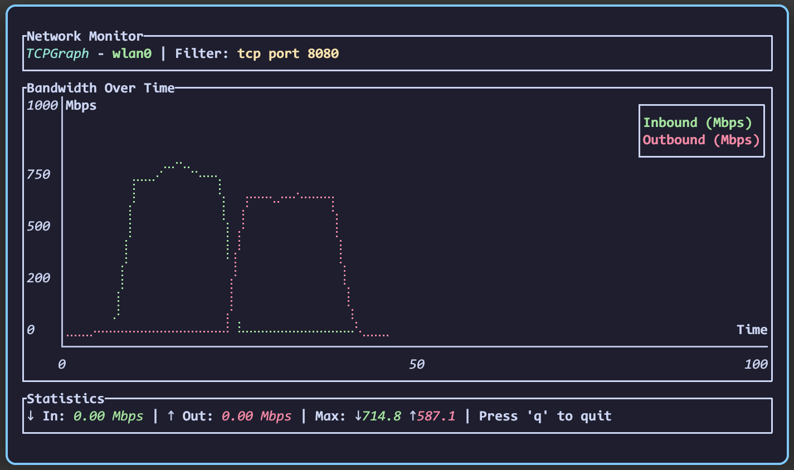

# TCPGraph

A terminal-based network bandwidth monitor that captures packets using pcap filters and displays real-time bandwidth graphs.



## Features

- Real-time packet capture with pcap filtering
- **Bidirectional traffic monitoring** - separate inbound and outbound bandwidth tracking
- Live bandwidth visualization with dual-line graphs (green=inbound, red=outbound)
- Intelligent speed bucket scaling (auto-adjusts from 0-10 Mbps to 1000+ Mbps)
- **Smart traffic direction detection** - works with specific interfaces and the "any" pseudo-interface
- **Interface validation on startup** - automatically lists available interfaces if invalid one specified
- Configurable update intervals
- Supports any network interface including "any" for all-interface monitoring
- Graceful shutdown with Ctrl+C
- Cross-platform terminal UI

## Installation

### Prerequisites

- Rust (1.70 or later)
- libpcap development libraries:
  - **Ubuntu/Debian**: `sudo apt install libpcap-dev`
  - **CentOS/RHEL**: `sudo yum install libpcap-devel`
  - **macOS**: `brew install libpcap` (usually pre-installed)
  - **Windows**: WinPcap or Npcap

### Build from source

```bash
git clone https://github.com/metalgrid/tcpgraph.git
cd tcpgraph
cargo build --release
```

### Build inside a docker container, export the binary

```bash
git clone https://github.com/metalgrid/tcpgraph.git
cd tcpgraph
docker build -f docker/Dockerfile --output=. .
```

> The resulting executable will be located under ./artifacts

## Usage

### Basic Usage

```bash
tcpgraph --interface eth0 --filter "tcp port 80"
```

### Options

- `-i, --interface <INTERFACE>`: Network interface to monitor (required)
- `-f, --filter <FILTER>`: PCAP filter expression (required)
- `--interval <SECONDS>`: Graph update interval in seconds (default: 1)
- `--duration <SECONDS>`: Total monitoring duration in seconds (optional)

### Examples

**Monitor HTTP traffic on eth0:**

```bash
tcpgraph -i eth0 -f "tcp port 80"
```

**Monitor all TCP traffic with 2-second updates:**

```bash
tcpgraph -i wlan0 -f "tcp" --interval 2
```

**Monitor all interfaces (useful for complex network setups):**

```bash
tcpgraph -i any -f "tcp"
```

**Monitor with payload-only counting (like Ookla speedtest):**

```bash
tcpgraph -i eth0 -f "tcp" --payload-only
```

**Monitor with increased smoothing to reduce spikes:**

```bash
tcpgraph -i eth0 -f "tcp" --smoothing 5
```

**Monitor SSH traffic for 60 seconds:**

```bash
tcpgraph -i eth0 -f "tcp port 22" --duration 60
```

**Monitor specific host traffic:**

```bash
tcpgraph -i eth0 -f "host 192.168.1.100"
```

**Monitor DNS queries:**

```bash
tcpgraph -i eth0 -f "udp port 53"
```

### Router/Firewall Usage

**Monitor router WAN interface:**

```bash
tcpgraph -i eth0 -f "ip"  # All IP traffic on WAN interface
```

**Monitor router LAN traffic:**

```bash
tcpgraph -i br0 -f "tcp"  # TCP traffic on bridge interface
```

**Monitor all router interfaces:**

```bash
tcpgraph -i any -f "ip"  # All IP traffic across all interfaces
```

### PCAP Filter Examples

- `tcp`: All TCP traffic
- `udp`: All UDP traffic
- `tcp port 80`: HTTP traffic
- `tcp port 443`: HTTPS traffic
- `host 192.168.1.1`: Traffic to/from specific IP
- `net 192.168.1.0/24`: Traffic to/from subnet
- `tcp and port 80`: TCP traffic on port 80
- `not tcp`: All non-TCP traffic

## Interface

The application displays:

- **Top panel**: Interface name and current filter
- **Middle panel**: Real-time dual-line bandwidth graph (Mbps over time) with intelligent scaling and grid lines
  - **Green line**: Inbound traffic (downloads)
  - **Red line**: Outbound traffic (uploads)
- **Bottom panel**: Current inbound/outbound speeds and maximum recorded values

### Traffic Direction Detection

- **MAC Address Analysis**: Uses Layer 2 (Ethernet) frame inspection for accurate direction detection
- **Router-Friendly**: Works correctly on routers, firewalls, and bridge devices where traffic may not originate locally
- **Direction Logic**:
  - **Inbound**: Destination MAC matches local interface(s)
  - **Outbound**: Source MAC matches local interface(s)
  - **Transit/Unknown**: Neither source nor destination MAC is local (router forwarding scenario)
- **Interface Support**:
  - **Specific interfaces** (e.g., eth0, wlan0): Uses that interface's MAC address
  - **"any" interface**: Uses MAC addresses from all active network interfaces
- **Edge Cases**: Broadcast/multicast traffic properly classified based on source interface

### Bandwidth Calculation Accuracy

tcpgraph offers two measurement modes to address discrepancies with speed testing tools:

#### **Standard Mode (default)**

- Counts entire Ethernet frames including all headers
- Shows total network utilization including protocol overhead
- Typically 10-20% higher than application-layer tools like Ookla

#### **Payload-Only Mode (`--payload-only`)**

- Strips Layer 2, 3, and 4 headers
- Counts only application data payload
- More comparable to Ookla speedtest results
- Better for measuring actual data transfer rates

#### **Smoothing (`--smoothing N`)**

- Reduces spikes and drops in measurements
- Uses moving average over N samples (default: 3)
- Higher values = smoother but less responsive
- Lower values = more responsive but potentially spiky

### Controls

- **q** or **Esc**: Quit the application
- **Ctrl+C**: Graceful shutdown

## Permissions

Network packet capture typically requires elevated privileges:

```bash
# Run with sudo (Linux/macOS)
sudo tcpgraph -i eth0 -f "tcp"

# Or add capabilities (Linux only)
sudo setcap cap_net_raw,cap_net_admin=eip ./target/release/tcpgraph
```

## Troubleshooting

### Common Issues

**"Permission denied" errors:**

- Run with `sudo` or set appropriate capabilities
- Ensure your user has access to network interfaces

**"Interface not found" errors:**

- tcpgraph will automatically list all available interfaces if you specify an invalid one:

```bash
$ tcpgraph -i invalid -f "tcp"
Error: Interface 'invalid' not found.

Available interfaces:
  - any (Pseudo-device that captures on all interfaces)
  - eth0 (Ethernet)
  - wlan0 (Wireless)
  - lo (Loopback)
```

- Use the exact interface name (e.g., `eth0`, `wlan0`, `en0`)
- Use `any` to monitor all interfaces simultaneously

**"Failed to set packet filter" errors:**

- Verify your pcap filter syntax
- Test filters with tools like `tcpdump` first
- Build a filter using a tool like [tcpdump101](https://tcpdump101.com/)

### Performance

- Higher update intervals (--interval) reduce CPU usage
- Complex filters may impact performance
- Large amounts of traffic may require filtering to specific ports/hosts

## License

This project is licensed under the [MIT License](LICENSE).
